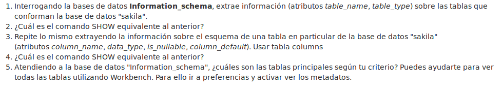
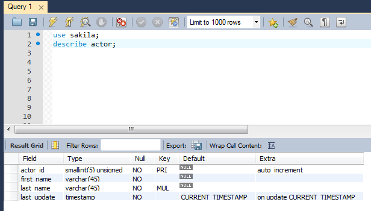
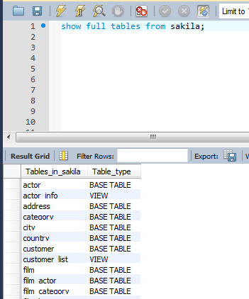
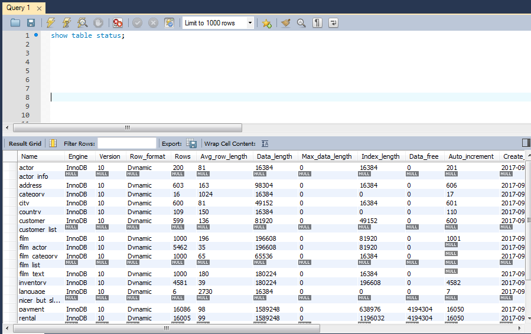
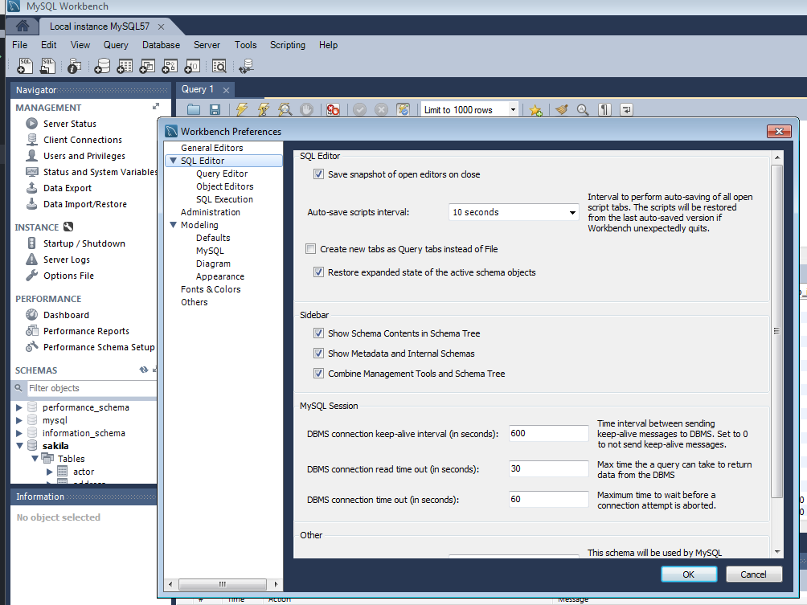
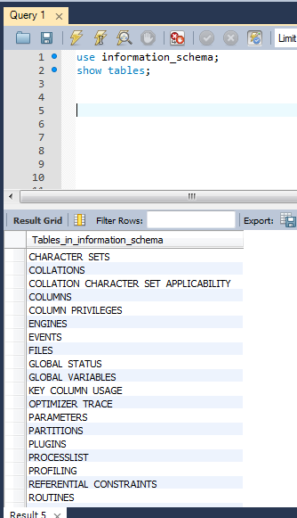

# Diccionario de datos.

Extraemos información sobre la base de datos **sakila** con `describe [nombre_de_la_tabla]`.

El comando **show** equivalente al anterior es `show full tables sakila`.

Podemos extraer información de la bse de datos con otro comando **show** como `show table status`.

Después de tildar la opción de `Show Metadata and Internal Schemas`...

... podemos observar tablas ocultas que antes no veíamos.

Bajo mi criterio pienso que las tablas más importantes son `FILES` y `GLOBAL STATUS`. Estas tablas almacenan información delicada.
