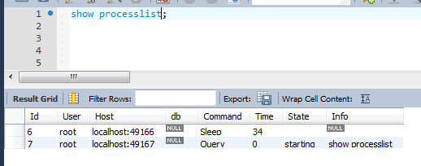

# Fichero de opciones y variables de servidor.

Para esta práctica vamos a necesitar leer el documento siguiente http://dev.mysql.com/doc/refman/5.7/en/option-files.html para conocer cómo usar los archivos de opciones.

Ahora buscaremos nuestro archivo **my.ini** que, según el enlace de arriba se encuentra en `ProgramData -> MySQL -> MySQL Server 5.7`.

Una pregunta común sería cómo hacer comentarios y grupos y, en la imagen siguiente, se explica claramente.

Otra pregunta sería explicar qué significan y qué se consigue con cada una de estas variables a continuación.

Según la imagen de arriba el apartado `[client]` hace referencia al usuario y las especificaciones que tiene para acceder al sistema tales como el puerto por el que se conecta y su contraseña. Después en el `[mysqld]` se observa que el puerto por el que entra es el 3306 y su información respectiva.

**A continuación** vamos a ver las...

### Variables de servidor.

* Las **variables del servidor** son indican cómo está configurado el sistema y cada variable del sistema tiene un valor distinto.

* El comando `show variables` sirve para conocer el valor de todas las variables.

* También podemos buscar las variables de InnoDB.

* El comando `show` sirve para gestionar todas las variables como mostrar los motores de almacenamiento, el estado actual del servidor y averiguar todos los clientes mostrados en orden a continuación.

### Variables de estado.

* Las **variables de estado**  proveen información sobre su operación.

* El comando `show status` sirve para conocer el valor de todas las variables.

* Se puede comprobar quién está conectado usando el comando `show processlist`.

* Intentamos desconectar a un usuario con `kill`.

* El comando para averiguar el máximo de conexiones concurrentes es `show processlist`.

### Variables dinámicas.

* Podemos saber el tipo de una variable usando el comando `typeof`.

* `uptime` es un comando para señalar la cantidad de tiempo que un computador está operativo.

* No se puede cambiar el `uptime` con `set`, sino con `update`.
