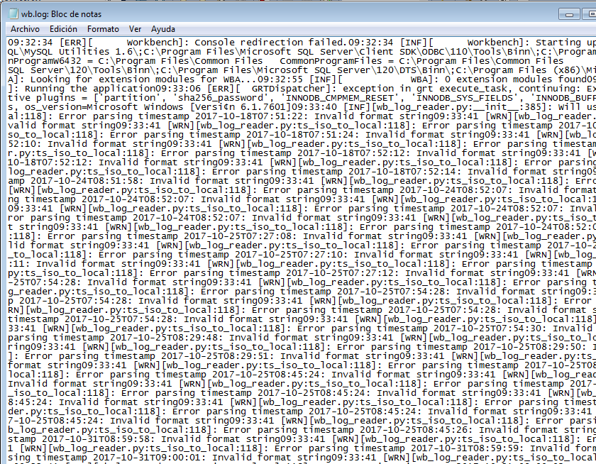

# Ficheros LOG

### Error LOG

* Los ficheros LOG son problemas encontrados arrancando, trabajando o parando mysqld. Información sacada de https://dev.mysql.com/doc/refman/5.7/en/server-logs.html

* El archivo cnf y los archivos log se almacenan en esta dirección.

* En el momento en que cerramos forzosamente el servicio vemos que los archivos log siguen iguales.

* El comando `perror` muestra por pantalla una descripción para un error de código de sistema. Información sacada de https://dev.mysql.com/doc/refman/5.7/en/perror.html

### General Query LOG

* El **General Query Log** establece conexiones de cliente e información recibida de los clientes. Información sacada de https://dev.mysql.com/doc/refman/5.7/en/server-logs.html

* Comprobamos el funcionamiento de los errores.

* Accediendo al fichero de los logs dentro del Workbench en `Server Logs` podemos observar las últimas conexiones y consultas realizadas.

* Desde el servidor podemos observar que hay más archivos de error que el cliente.

