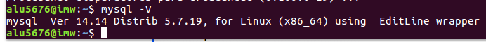
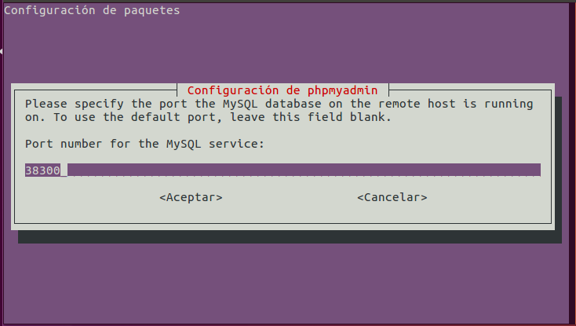
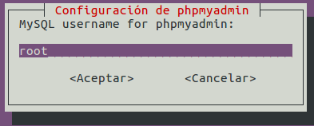
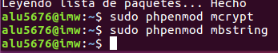
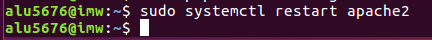
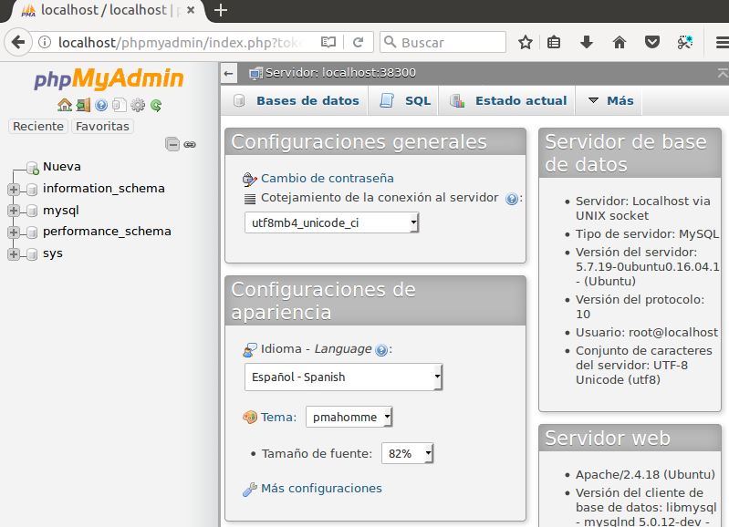

# Instalación de MySQL en Ubuntu

En esta práctica vamos a instalar el MySQL en una máquina Ubuntu.

- Lo primero que hay que hacer es entrar en nuestro terminal e insertar el siguiente comando.

- Después de la instalación debemos averiguar la versión de nuestro MySQL. Insertamos este comando.

- También debemos instalar el cliente.

- El siguiente paso será reinicar el demonio `mysqld`. Para ello insertamos el comando a continuación.

- Ahora probaremos la conexión de cliente a servidor de MySQL.

- Después de la instalación y de monitorizar la conexión de cliente a servidor, vamos a configurar su seguridad post-instalación.

- Nuestro siguiente paso es instalar el Workbench.

- Nuestro siguiente paso será instalar el PHPMyAdmin sobre Apache. Lo primero es instalar el phpmyadmin.

`Nos aparecerá una ventana que nos preguntará sobre instalar apache. Con la barra espaciadora aceptamos en apache.`

- A lo largo de la instalación nos preguntará sobre qué puerto queremos trabajar.

- El usuario.

- Es importante tener iniciado el Apache como muestra la imagen.

- Con estos comandos habilitamos  las extensiones PHP`mcrypt`
 y `mbstring`.

- Debemos reiniciar el apache para los cambios surgidos.

- Entramos en `localhost/phpmyadmin` e insertamos nuestro usuario y contraseña.

- El archivo de configuración es `/etc/apache2/conf-enabled/`.

- El usuario propietario de la instalación es `mysql`.

- El proceso demonio es `mysqld`
