## INSTALACIÓN DE MYSQL COMMUNITY SOBRE WINDOWS

- Comenzaremos instalando el MySL Community en modo Developer en nuestra MV con Windows 7

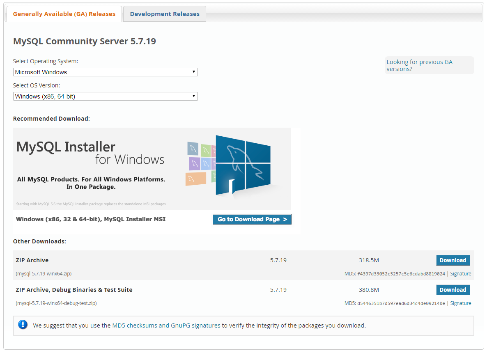

- Lo descargaremos de la página oficial. En este momento pueden surgir algunos problemas con paquetes adicionales que debemos descargar a parte para que todo funcione a la perfección.

- En la imagen de arriba podemos observar una página que nos servirá para instalar el Visual C++ que se consigue de esta página https://support.microsoft.com/en-us/help/3179560/update-for-visual-c-2013-and-visual-c-redistributable-package

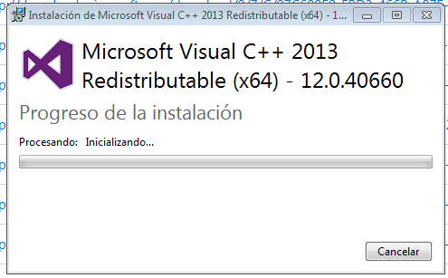

- Otro paquete que deberemos instalarnos será el .NET Framework que lo buscaremos también en la página oficial. https://www.microsoft.com/es-es/download/details.aspx?id=17851

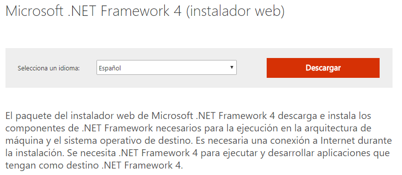

- Y lo instalamos.

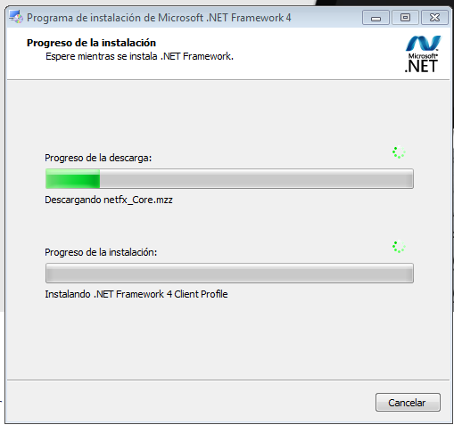

- También existe la probabilidad de que se necesite instalar el Python para continuar con la instalación óptima del MySQL.

- Una vez instalado esto último podemos comenzar con la instalación del MySQL.

- `Es importante para esta práctica ponerlo en "Developer"`

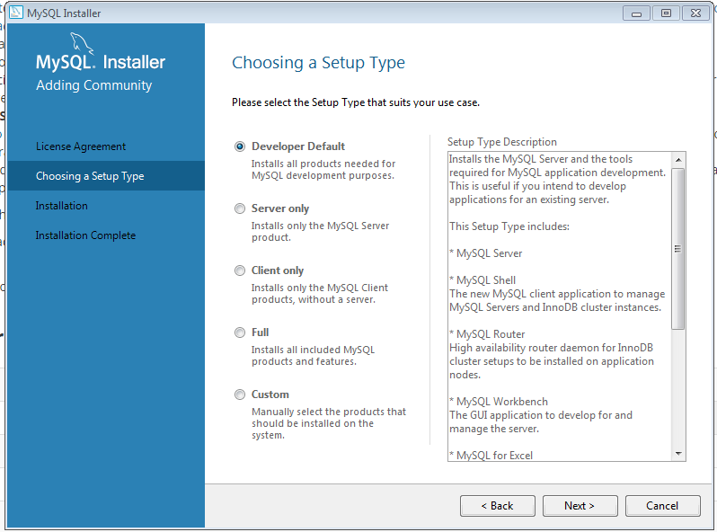

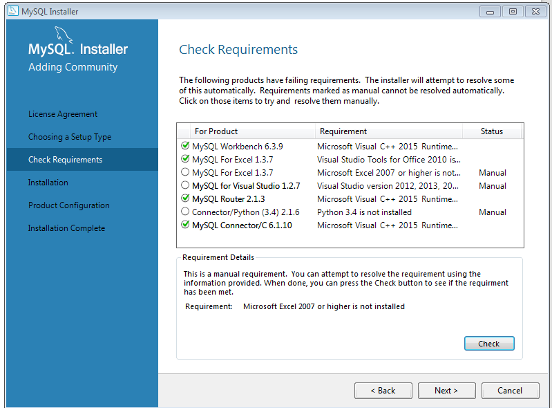

- `Esta ventana de aquí arriba es importante por que hay que chequear todas las celdas que hay debido a que no debe fallar nada`.

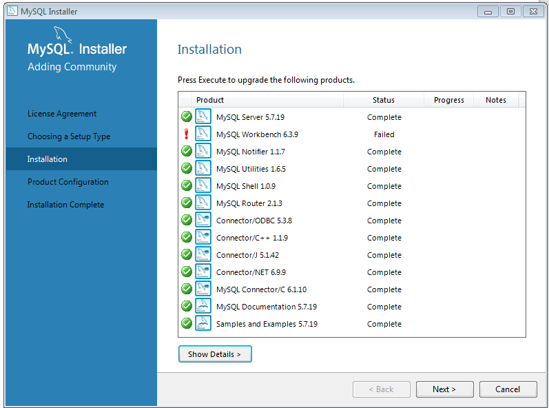

- `La segunda ventana es similar a la anterior. Hay que probar e instalar todos los componentes.`

Una vez instalado el programa saldrá en la barra de `Inicio` un archivo donde tenemos instalado el MySQL llamado `MySQL Server → Command Line Client`. Esta será la ventana donde nosotros trabajaremos.

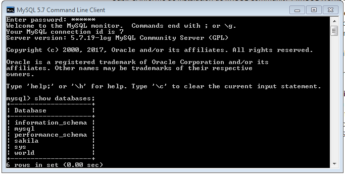

- Accediendo a la ventana `Servicios` a partir del menú `Inicio` podemos observar que nuestro MySQL está habilitado.

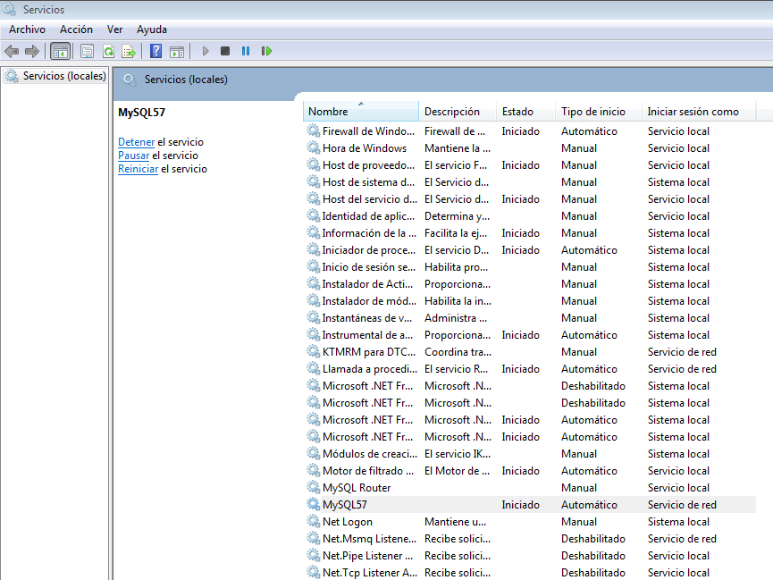

- Los archivos se encuentran en la carpeta `AppData` de nuestro ordenador.

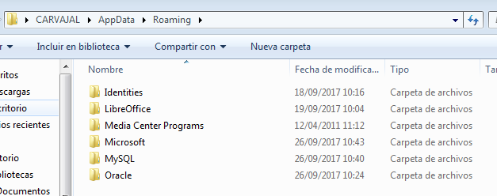

- Instalamos el `MySQL WorkBench` en el cliente.

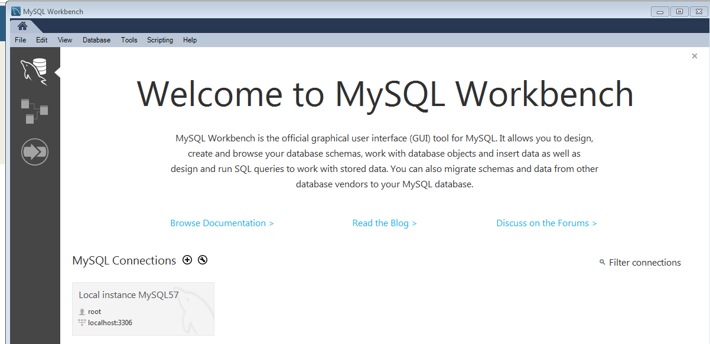

- Ahora procederemos a instalar el `XAMPP` para relacionar el servidor con el cliente.

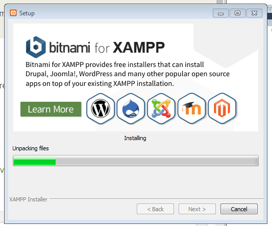

- Y queda de esta manera.

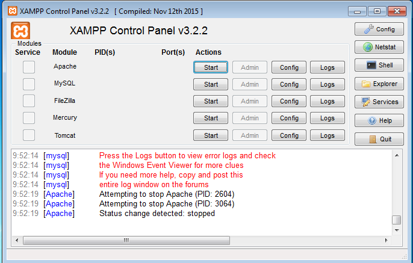

- En este paso intentaremos entrar en phpMyadmin pero tendremos un error así que hay que configurar como en el ejemplo de la página https://tech.enekochan.com/es/2015/02/06/solucionar-configuration-pmadb-not-ok-en-phpmyadmin/  un archivo dentro de xampp llamado `config.inc.php`

