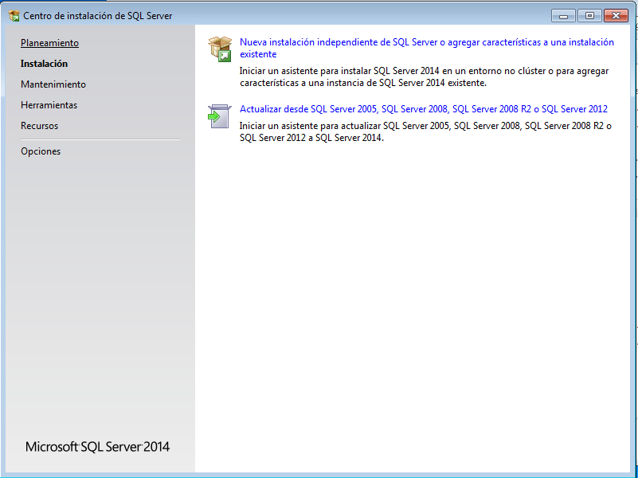
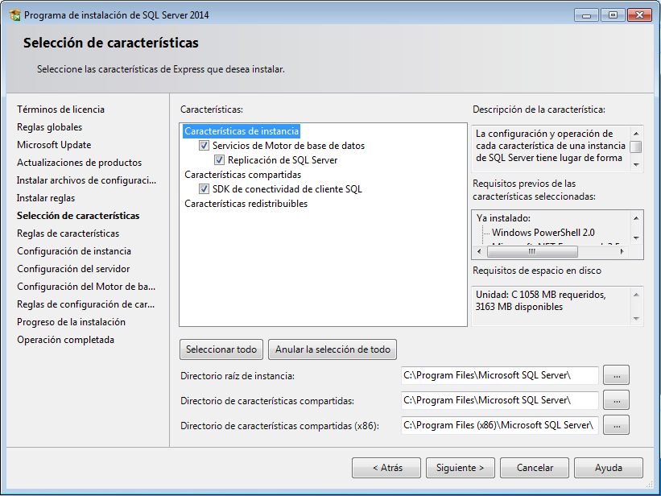
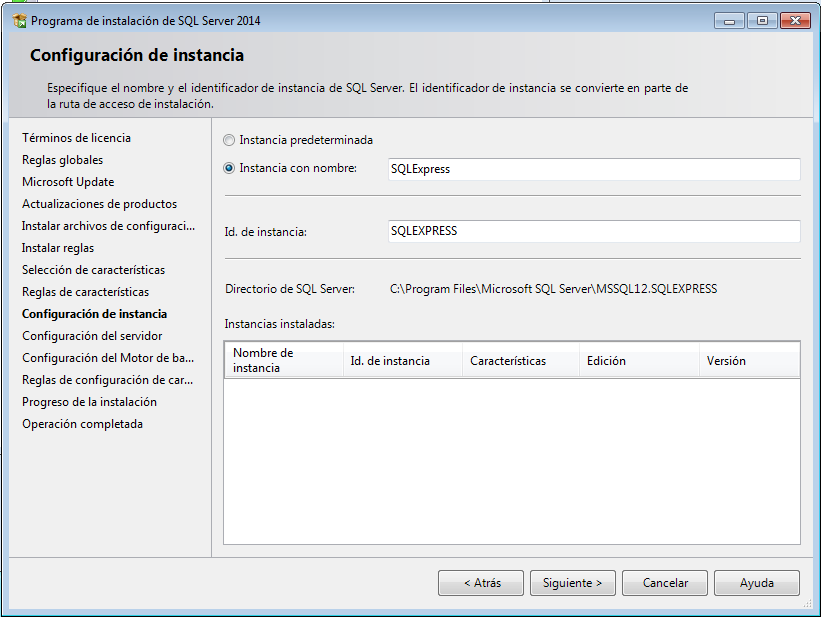
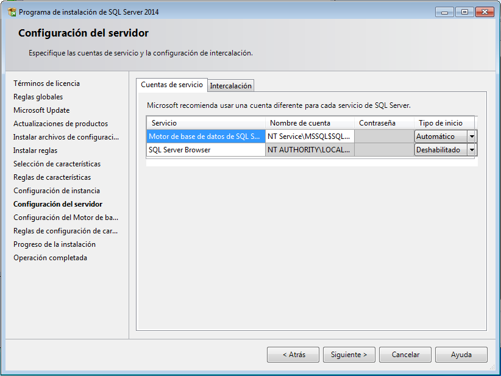
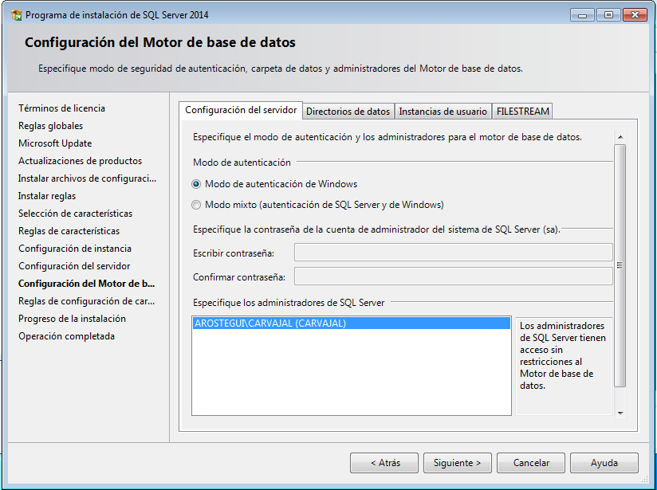
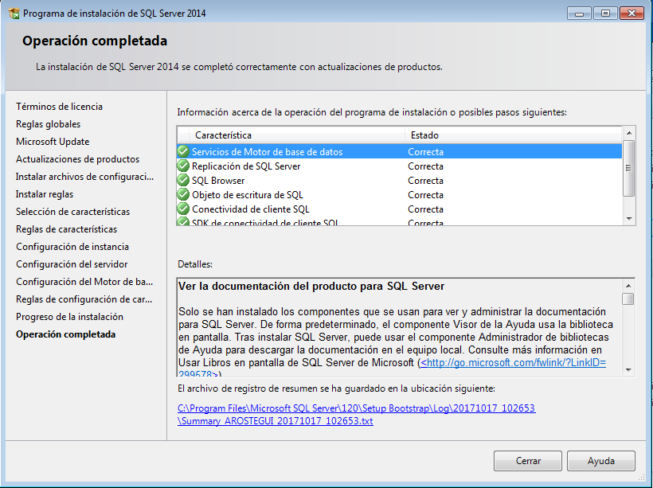
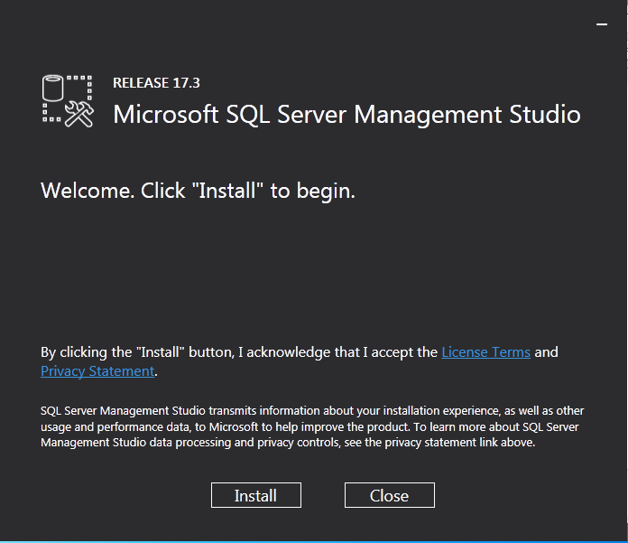
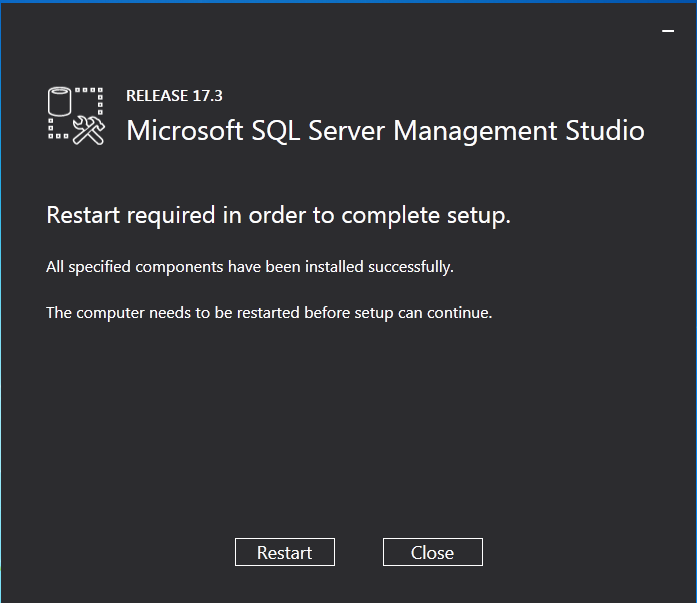
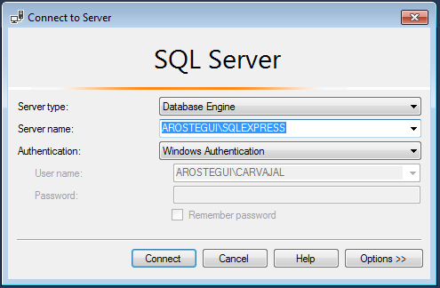
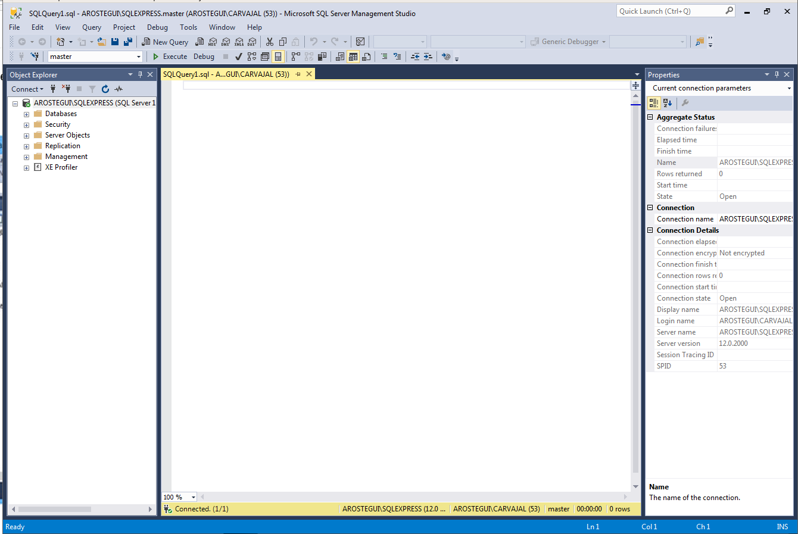

# Instalación de SQL Server 2014

Para esta práctica vamos a necesitar una máquina virtual **Windows 7**

Accediendo a la página https://www.microsoft.com/es-es/download/details.aspx?id=42299
descargamos el **SQL Server 2014** y el **Management Studio** en la misma descarga.

Ahora iniciamos la descarga de **Management Studio** de esta página https://docs.microsoft.com/es-es/sql/ssms/download-sql-server-management-studio-ssms .

Después de reiniciar el ordenador, hacemos una prueba de conexión con en **SQl Server** .

Hacemos conexión, viendo que es satisfactoria.

