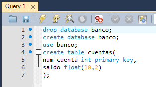
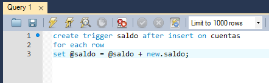
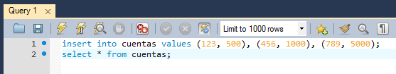
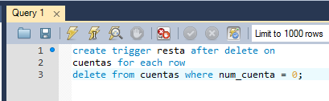
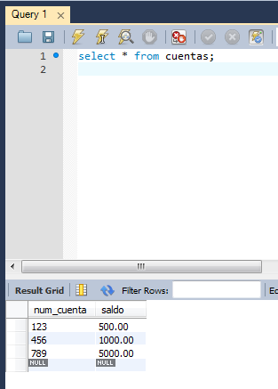

# Actividad de Triggers

Creamos una base de datos llamada banco con la tabla **cuentas** y dos campos.

Creamos un trigger que guarde en una variable, llamada saldo, el acumulativo de los valores insertados en cada una de las tuplas.

Insertar valores y comprobar el total de saldo insertado con un select.

Crear tambien un trigger que reste cuando eliminamos una tupla.

Comprobar el total del saldo después de los borrados.

