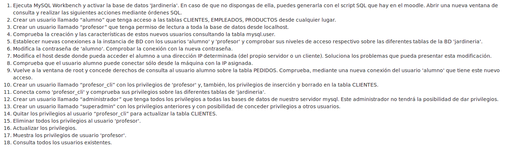
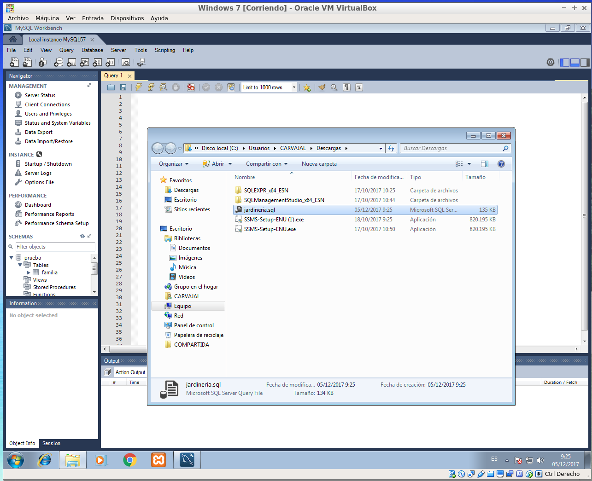
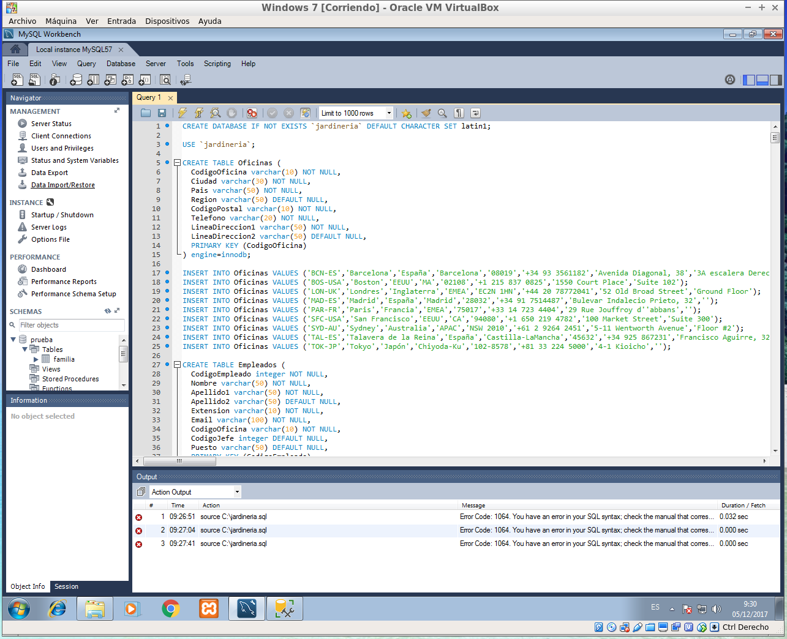
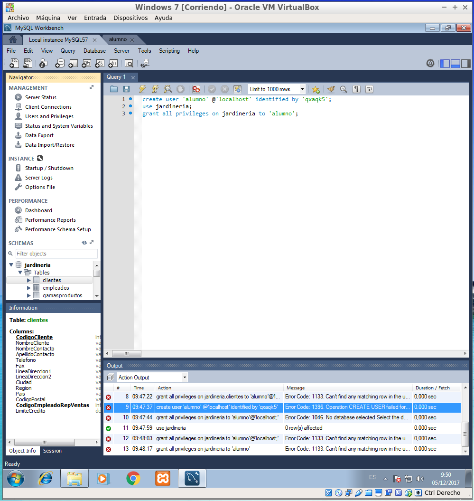
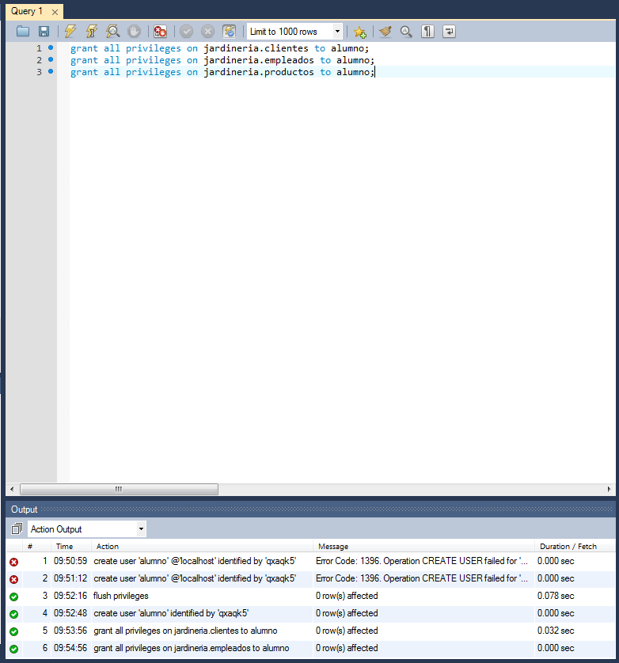
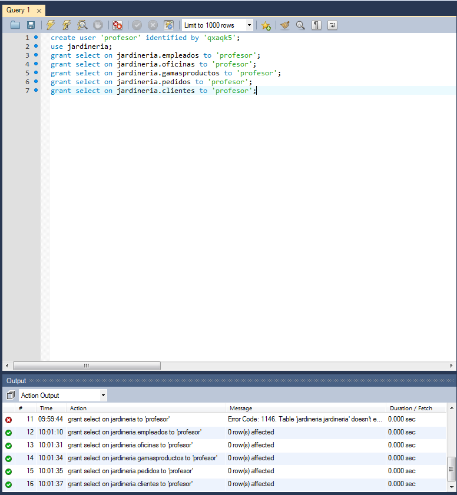
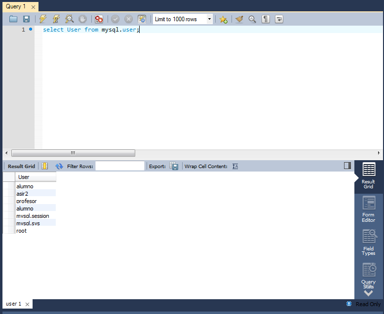
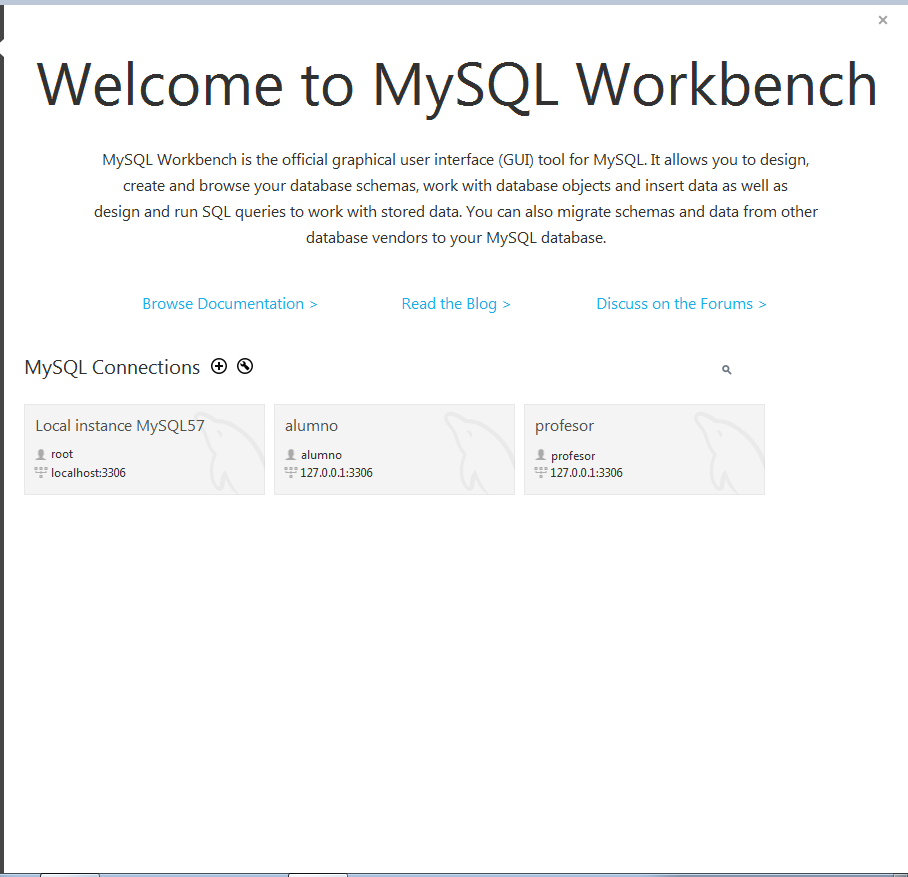
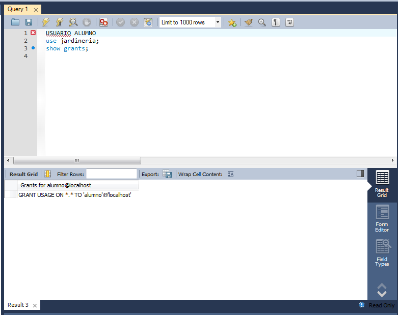
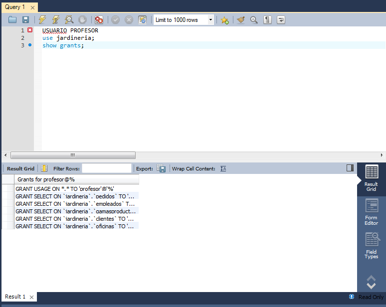

# Práctica Usuarios y Privilegios MySQL

*Vamos a usar la base de datos de jardinería donde efectuaremos las consultas.*

*Ahora crearemos un usuario que tenga acceso a algunas tablas desde cualquier lugar.*

*Creamos un nuevo usuario llamado profesor que tenga acceso a todo desde localhost.*

*Comprobamos que estos usuarios existen.*

*Hacemos conexión desde los usuarios creados y vemos sus especificaciones.*

*Vamos a modificar la contraseña de alumno y veremos si entramos correctamente. PUNTO 6*
